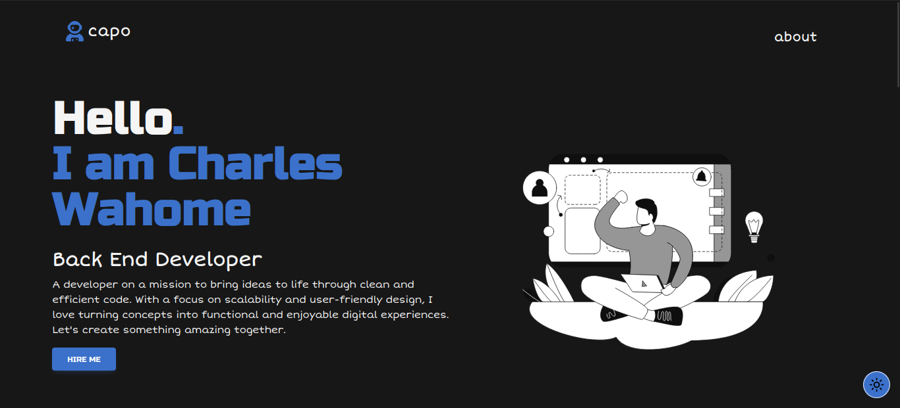

# My Portfolio

[](https://opensource.org/licenses/MIT)

Welcome to my personal portfolio! This repository contains the source code for my portfolio website, showcasing my projects, skills, and more.

## Table of Contents

- [Demo](#demo)
- [Technologies Used](#technologies-used)
- [Features](#features)
- [Installation](#installation)
- [License](#license)
- [Contact](#contact)

## Demo



Check out website [here](https://kariuki.tech).

## Technologies Used

- [Vue.js](https://vuejs.org/)
- [Tailwind CSS](https://tailwindcss.com/)


## Features

- **Responsive Design:** The portfolio is designed to be responsive and accessible on various devices.
- **Project Showcase:** Highlight your best projects with descriptions, images, and links.
- **Skills Section:** Showcase your skills and technologies you are proficient in.
- **Vue.js Components:** Leverage Vue.js for building interactive and dynamic components.
- **Tailwind CSS Styling:** Use Tailwind CSS for efficient and customizable styling.

## To Do

- **Projects Section**
- **Contact Form**
- **Blog**

## Installation

1. Clone the repository:

   ```bash
   git clone https://github.com/realcapobambino/portfolio.git

2. Navigate to the project directory:

    ```bash
    cd portfolio

3. Install all the dependencies:

    ```bash
    bun install

4. Start the development server

    ```bash
    bun run dev

## Contributing

If you'd like to contribute to the project, follow these steps:

1. Fork the repository.

2. Create a new branch:

    ```bash
    git checkout -b feature/new-feature.

3. Commit your changes:

    ```bash
    git commit -m 'Add new feature'.

4. Push to the branch:

    ```bash
    git push origin feature/new-feature.

5. Open a pull request.


## Contact

Feel free to reach out to me via email at charleswkariuki007@gmail.com or connect with me on [LinkedIn](https://www.linkedin.com/in/charleswahome/).

## Made with ♥️
## Powered by VueJs